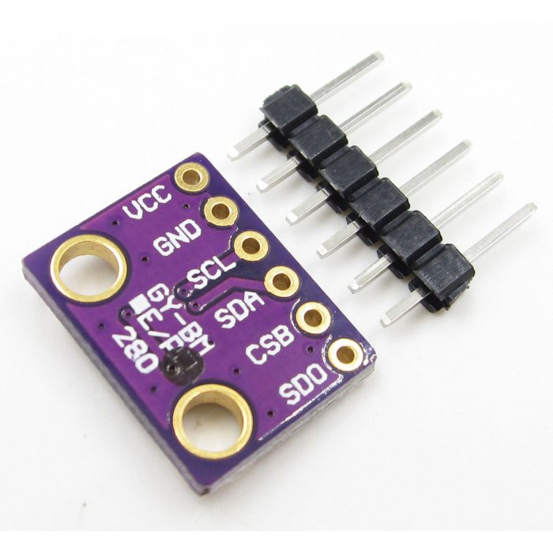

# Sensor BMP280

O sensor BMP280 é utilizado para medir pressão atmosférica, temperatura e calcular altitude.



# Dados Técnicos do Sensor BMP280

| Característica        | Descrição                              |
|-----------------------|----------------------------------------|
| Tipo                  | Sensor digital de pressão e temperatura |
| Tensão de Operação    | 3.3V a 5V                             |
| Faixa de Pressão      | 300 a 1100 hPa                       |
| Precisão Pressão      | ±1 hPa                                |
| Faixa de Temperatura  | -40°C a 85°C                          |
| Precisão Temperatura  | ±1°C                                  |
| Interface             | I2C e SPI                             |
| Endereço I2C          | 0x76 ou 0x77                         |
| Consumo de Corrente   | <1mA                                  |

## Pinagem do BMP280

| Pino | Função          | Descrição                             |
|------|-----------------|---------------------------------------|
| 1    | VCC             | Alimentação (3.3V ou 5V)             |
| 2    | GND             | Terra (Ground)                       |
| 3    | SCL             | Clock I2C                            |
| 4    | SDA             | Dados I2C                            |
| 5    | CSB             | Chip Select (apenas para SPI)        |
| 6    | SDO             | Dados SPI (apenas para SPI)          |

## Componentes
- Módulo sensor BMP280
- Resistores pull-up (geralmente já incluídos no módulo)

## Recomendações

- **Conexão I2C**: Para projetos com múltiplos sensores I2C, verifique o endereço do sensor (0x76 ou 0x77).
- **Capacitor**: Recomenda-se um capacitor de desacoplamento (100nF) próximo ao sensor para estabilidade.
- **Calibração**: O sensor já vem calibrado de fábrica, mas pode ser recalibrado se necessário.

## Exemplo de Código

Segue um exemplo de código para leitura de dados do BMP280 usando Arduino:

```cpp
#include <Wire.h>
#include <Adafruit_BMP280.h>

#define BMP_SDA 21  // Pino SDA
#define BMP_SCL 22  // Pino SCL

Adafruit_BMP280 bmp;

void setup() {
  Serial.begin(115200);
  Serial.println("Iniciando leitura do BMP280");
  
  // Inicializar I2C
  Wire.begin(BMP_SDA, BMP_SCL);
  
  // Tentar conectar no endereço 0x76 ou 0x77
  if (!bmp.begin(0x76) && !bmp.begin(0x77)) {
    Serial.println("Erro: BMP280 não encontrado!");
    while (1);
  }
  
  // Configurar sampling
  bmp.setSampling(Adafruit_BMP280::MODE_NORMAL,
                  Adafruit_BMP280::SAMPLING_X2,
                  Adafruit_BMP280::SAMPLING_X16,
                  Adafruit_BMP280::FILTER_X16,
                  Adafruit_BMP280::STANDBY_MS_500);
}

void loop() {
  float temperatura = bmp.readTemperature();
  float pressao = bmp.readPressure() / 100.0F; // Converter para hPa
  float altitude = bmp.readAltitude(1013.25); // Pressão ao nível do mar

  Serial.print("Temperatura: ");
  Serial.print(temperatura);
  Serial.println(" °C");
  
  Serial.print("Pressão: ");
  Serial.print(pressao);
  Serial.println(" hPa");
  
  Serial.print("Altitude: ");
  Serial.print(altitude);
  Serial.println(" m");
  
  Serial.println("------------------------");
  
  delay(2000); // Intervalo de 2 segundos entre leituras
}
```

# Saída no Terminal

- Teste de 8 segundos total de 4 leituras

```
Iniciando leitura do BMP280
Temperatura: 23.45 °C
Pressão: 1013.25 hPa
Altitude: 45.32 m
------------------------
Temperatura: 23.47 °C
Pressão: 1013.28 hPa
Altitude: 45.29 m
------------------------
Temperatura: 23.46 °C
Pressão: 1013.26 hPa
Altitude: 45.31 m
------------------------
Temperatura: 23.48 °C
Pressão: 1013.30 hPa
Altitude: 45.27 m
------------------------
```

## Aplicações no Sistema de Irrigação

- **Detecção de Tempestades**: Pressão abaixo de 1000 hPa pode indicar tempestade
- **Condições Climáticas**: Pressão acima de 1020 hPa indica tempo estável