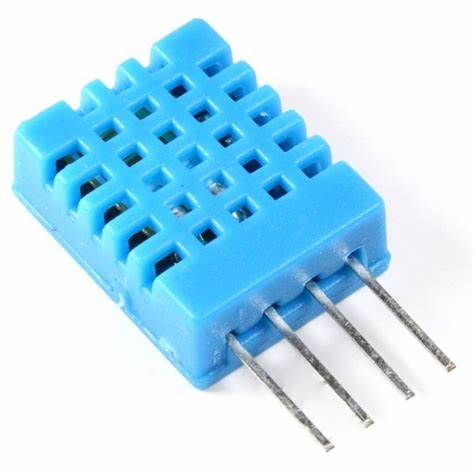

# Sensor DHT11

O sensor DHT11 é utilizado para medir temperatura, umidade e sensação térmica.



# Dados Técnicos do Sensor DHT11

| Característica        | Descrição                              |
|-----------------------|----------------------------------------|
| Tipo                  | Sensor digital de temperatura e umidade |
| Tensão de Operação    | 3.3V a 5.5V                           |
| Faixa de Temperatura  | 0°C a 50°C                            |
| Precisão Temperatura  | ±2°C                                  |
| Faixa de Umidade      | 20% a 90%                             |
| Precisão Umidade      | ±5%                                   |
| Tempo de Resposta     | 2 segundos                            |

## Pinagem do DHT11

| Pino | Função          | Descrição                     |
|------|-----------------|-------------------------------|
| 1    | VCC             | Alimentação (3.3V ou 5V)     |
| 2    | Data            | Dados do sensor              |
| 3    | Não Conectado   | Não utilizado                |
| 4    | GND             | Terra (Ground)               |

## Recomendações

- **Uso de resistor**: Para comunicação estável, recomenda-se o uso de um resistor pull-up de 5kΩ-10kΩ entre o pino de dados e o VCC.
- **Capacitor**: Em ambientes ruidosos, você pode usar um capacitor de desacoplamento (100nF) entre o VCC e o GND.

## Exemplo de Código

Segue um exemplo de código para leitura de dados do DHT11 usando Arduino:

```cpp
#include <DHT.h> // Biblioteca Necessária

// Definir o pino do sensor e o tipo
#define DHTPIN 4 // Pino de dados conectado ao pino digital 2
#define DHTTYPE DHT11 // Definir o modelo do sensor (DHT11)

DHT dht(DHTPIN, DHTTYPE);

void setup() {
  Serial.begin(9600);
  Serial.println("Iniciando leitura do DHT11");
  dht.begin();
}

void loop() {
  float temperatura = dht.readTemperature();
  float umidade = dht.readHumidity();

  if (isnan(temperatura) || isnan(umidade)) {
    Serial.println("Falha ao ler os dados do sensor!");
    return;
  }

  Serial.print("Temperatura: ");
  Serial.print(temperatura);
  Serial.println(" °C");
  
  Serial.print("Umidade: ");
  Serial.print(umidade);
  Serial.println(" %");
  
  delay(2000); // Intervalo de 1 segundos entre leituras
}
```

#Saída no Terminal

-Teste de 8 segundosn total de 4 leituras

```
  Iniciando leitura do DHT11
  Temperatura: 25.60 °C
  Umidade: 59.00 %
  Temperatura: 25.60 °C
  Umidade: 59.00 %
  Temperatura: 25.60 °C
  Umidade: 59.00 %
  Temperatura: 25.60 °C
  Umidade: 59.00 %
```

