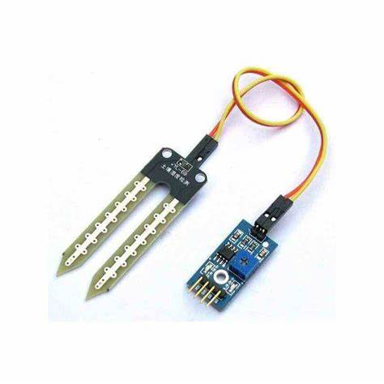

# Sensor de Umidade do Solo FC-28

O sensor de umidade do solo FC-28 é utilizado para medir o nível de umidade no solo através de condutividade elétrica.



# Dados Técnicos do Sensor FC-28

| Característica        | Descrição                              |
|-----------------------|----------------------------------------|
| Tipo                  | Sensor de umidade do solo capacitivo  |
| Tensão de Operação    | 3.3V a 5V                             |
| Corrente de Operação  | <20mA                                 |
| Saída Analógica       | 0V a 5V (varia com a umidade)         |
| Saída Digital         | Alta/Baixa (ajustável via potenciômetro) |
| Faixa de Medição      | 0% a 100% de umidade relativa do solo |
| Tempo de Resposta     | <1 segundo                            |
| Resistência à Corrosão| Limitada (requer cuidados)            |

## Pinagem do FC-28

| Pino | Função          | Descrição                             |
|------|-----------------|---------------------------------------|
| 1    | A0              | Saída Analógica                      |
| 2    | D0              | Saída Digital                        |
| 3    | GND             | Terra (Ground)                       |
| 4    | VCC             | Alimentação (3.3V ou 5V)             |

## Componentes
- Módulo sensor FC-28
- Módulo comparador LM393 (incluído no módulo)
- Resistores de pull-up (já incluídos)

## Recomendações

- **Calibração**: Calibre o sensor em solo seco (0%) e solo saturado (100%) para melhor precisão.
- **Proteção**: Use verniz ou silicone para proteger os contatos contra corrosão.
- **Posicionamento**: Insira o sensor completamente no solo para leituras precisas.
- **Manutenção**: Limpe regularmente os contatos para evitar oxidação.

## Exemplo de Código

Segue um exemplo de código para leitura de dados do FC-28 usando Arduino:

```cpp
#define SOIL_MOISTURE_PIN 36  // Pino analógico (ESP32)
#define SOIL_DIGITAL_PIN 2    // Pino digital (opcional)

// Valores de calibração (ajustar conforme necessário)
const int SOIL_DRY = 4095;    // Valor em solo seco (ESP32 ADC 12-bit)
const int SOIL_WET = 1500;    // Valor em solo molhado

void setup() {
  Serial.begin(115200);
  Serial.println("Iniciando leitura do FC-28");
  
  pinMode(SOIL_DIGITAL_PIN, INPUT);
}

void loop() {
  // Leitura analógica
  int soilReading = analogRead(SOIL_MOISTURE_PIN);
  
  // Converter para percentual (0-100%)
  int soilMoisture = map(soilReading, SOIL_DRY, SOIL_WET, 0, 100);
  soilMoisture = constrain(soilMoisture, 0, 100);
  
  // Leitura digital
  bool soilDigital = digitalRead(SOIL_DIGITAL_PIN);
  
  Serial.print("Valor Bruto: ");
  Serial.println(soilReading);
  
  Serial.print("Umidade do Solo: ");
  Serial.print(soilMoisture);
  Serial.println(" %");
  
  Serial.print("Status Digital: ");
  Serial.println(soilDigital ? "SECO" : "UMIDO");
  
  // Classificação da umidade
  if (soilMoisture < 30) {
    Serial.println("Status: SOLO SECO - Irrigação necessária");
  } else if (soilMoisture < 60) {
    Serial.println("Status: SOLO MODERADO");
  } else {
    Serial.println("Status: SOLO ÚMIDO");
  }
  
  Serial.println("------------------------");
  
  delay(2000); // Intervalo de 2 segundos entre leituras
}
```

# Saída no Terminal

- Teste de 8 segundos total de 4 leituras

```
Iniciando leitura do FC-28
Valor Bruto: 3456
Umidade do Solo: 45 %
Status Digital: UMIDO
Status: SOLO MODERADO
------------------------
Valor Bruto: 3234
Umidade do Solo: 52 %
Status Digital: UMIDO
Status: SOLO MODERADO
------------------------
Valor Bruto: 3678
Umidade do Solo: 38 %
Status Digital: SECO
Status: SOLO MODERADO
------------------------
Valor Bruto: 2890
Umidade do Solo: 65 %
Status Digital: UMIDO
Status: SOLO ÚMIDO
------------------------
```

## Aplicações no Sistema de Irrigação

- **Controle Automático**: Ativar irrigação quando umidade estiver abaixo do limite
- **Monitoramento Contínuo**: Acompanhar níveis de umidade em tempo real
- **Economia de Água**: Evitar irrigação desnecessária em solo já úmido
- **Dados Históricos**: Registrar padrões de umidade para análise
- **Alerta de Solo Seco**: Notificar quando plantas precisam de água