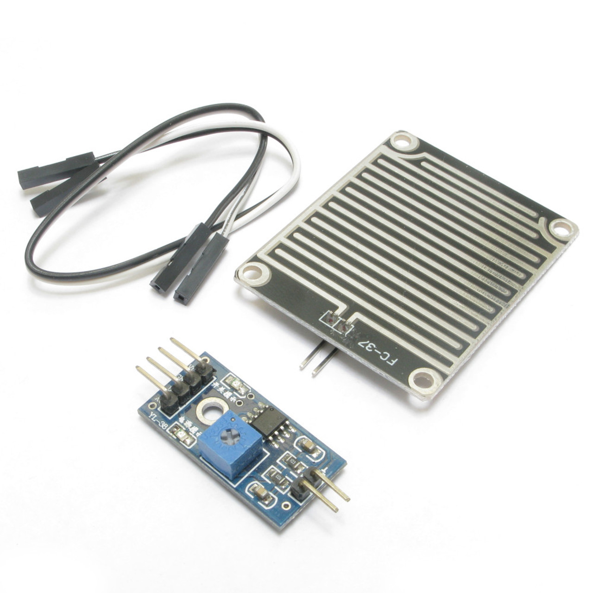

# Sensor de Chuva FC-37
O sensor de chuva FC-37 é utilizado para detectar a presença de água ou gotas de chuva.



# Dados Técnicos do Sensor FC-37

| Característica        | Descrição                              |
|-----------------------|----------------------------------------|
| Tipo                  | Sensor de chuva                       |
| Tensão de Operação    | 3.3V a 5V                             |
| Corrente de Operação  | <20mA                                 |
| Saída Analógica       | 0V a 5V (varia com a presença de água)|
| Saída Digital         | Alta/Baixa (ajustável via potenciômetro) |

## Pinagem do FC-37

| Pino | Função          | Descrição                             |
|------|-----------------|---------------------------------------|
| 1    | A0              | Saída Analógica                      |
| 2    | D0              | Saída Digital                        |
| 3    | GND             | Terra (Ground)                       |
| 4    | VCC             | Alimentação (3.3V ou 5V)             |

## Componentes
- Módulo sensor FC-37
- Módulo comparador LM393 (opcional, para saída digital)

## Código de Exemplo

```cpp
#define SENSOR_PIN A0

void setup() {
  Serial.begin(9600);
}

void loop() {
  int valorChuva = analogRead(SENSOR_PIN);
  Serial.print("Nível de Chuva: ");
  Serial.println(valorChuva);
  delay(1000);
}
