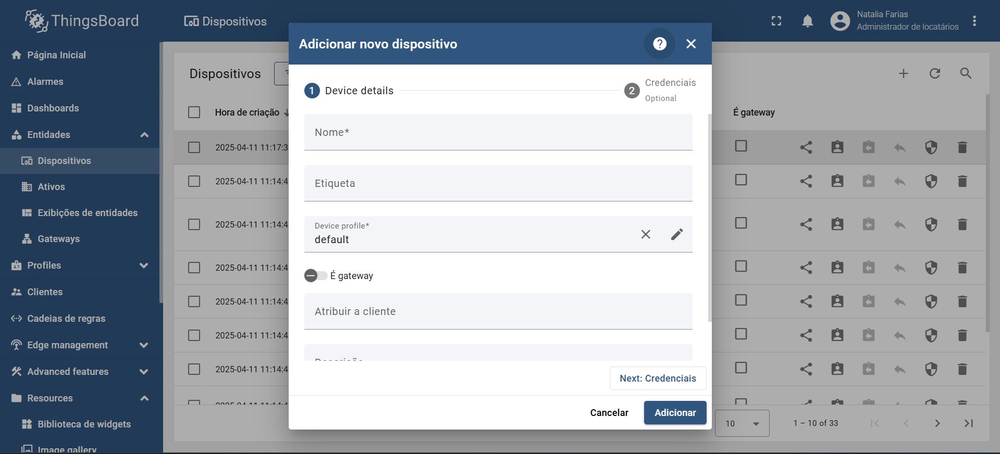
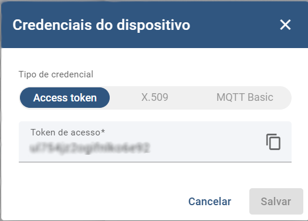
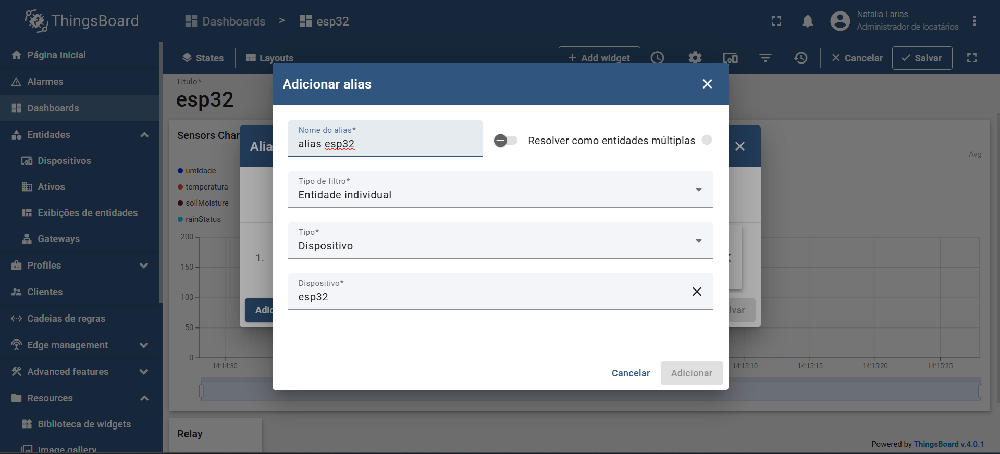
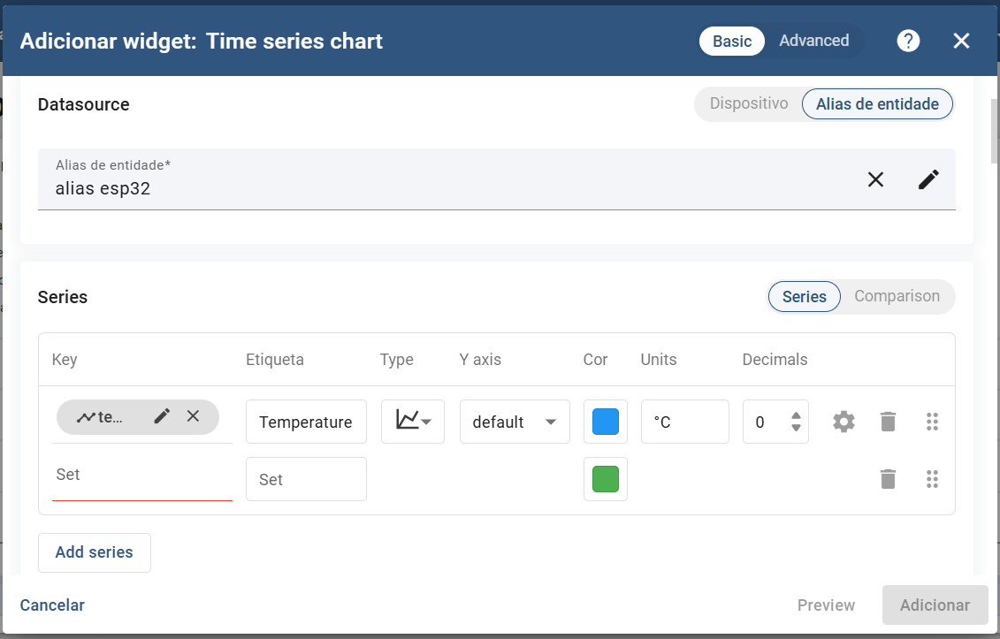

# 📘 Tutorial de Integração IoT com ThingsBoard

Este guia mostra como conectar um dispositivo (ESP32) à plataforma **ThingsBoard** usando o protocolo **MQTT**.

---

## 1. Criar Conta no ThingsBoard

Acesse o link abaixo para criar uma conta gratuita na plataforma demo:  
🔗 [https://demo.thingsboard.io/signup](https://demo.thingsboard.io/signup)

Se já tiver conta:  
🔗 [https://demo.thingsboard.io/login](https://demo.thingsboard.io/login)

---

## 2. Adicionar Dispositivo

1. Acesse **Entidades > Dispositivos** no menu lateral  
2. Clique em **+ > Adicionar novo dispositivo** no canto superior direito  

3. Defina um nome para o dispositivo e clique em **Adicionar** (os demais campos podem ser deixados como padrão)




---

## 3. Obter Token de Acesso (MQTT)

1. Selecione o dispositivo criado  
2. Vá em **Credenciais > Access Token**  
3. Copie o token para usar no ESP32



---

## 4. Código para o ESP32 (MQTT)

Configure sua conexão Wi-Fi, servidor MQTT e comunicação com o ThingsBoard.

### 🔧 Definições iniciais

```cpp
const char* ssid = "SUA_REDE";
const char* password = "SUA_SENHA";
const char* thingsboardServer = "demo.thingsboard.io";
const char* accessToken = "SEU_TOKEN";

WiFiClient espClient;
PubSubClient client(espClient);
```

### 📶 Conectar ao Wi-Fi e ThingsBoard

```cpp
void connectWiFi() {
  WiFi.begin(ssid, password);
  while (WiFi.status() != WL_CONNECTED) delay(1000);
}

void connectThingsBoard() {
  while (!client.connected()) {
    client.connect("ESP32Client", accessToken, NULL);
    client.subscribe("v1/devices/me/rpc/request/+");
  }
}
```

### 🚀 Inicialização e Loop

```cpp
void setupThingsBoard() {
  connectWiFi();
  client.setServer(thingsboardServer, 1883);
  client.setCallback(callback);
}

void maintainThingsBoard() {
  if (!client.connected()) connectThingsBoard();
  client.loop();
}
```

### 📤 Enviar Dados (telemetria)

```cpp
void sendTelemetry(float temp, float hum, float soil, float rain) {
  String payload = "{";
  payload += ""temperature":" + String(temp,1) + ",";
  // outras variaveis dos sensores
  client.publish("v1/devices/me/telemetry", payload.c_str());
}
```

---

## 5. Criar um Dashboard

1. Acesse **Dashboards** no menu lateral esquerdo
2. Clique em **+ > Criar novo dashboard**

---

## 5.1 Adicionar um Alias

1. No dashboard, clique em **Modo de Edição**  
2. Clique no ícone ao lado do ícone de configurações 

3. Configure o alias com as seguintes opções:
   - **Nome:** escolha um nome descritivo para o alias.
   - **Tipo de filtro:** `Entidade individual`
   - **Tipo:** `Dispositivo`
   - **Dispositivo:** selecione o dispositivo que você criou anteriormente.



---

## 5.2 Adicionar Gráficos

1. Clique em **+ Add Widget**  
2. Escolha **Charts > Time Series Chart**  
3. Configure:
   - Selecione o alias criado
   - Em **Series**, clique em **Add series** e escolha os dados publicados via MQTT pelo esp


---

## 5.3 Adicionar Botão Liga/Desliga

1. Clique em **+ Add Widget** 
2. Selecione: **Control Widgets > Switch**  
3. Vincule ao comando RPC abaixo
4. Após as modificações do Dashboard clique em `Salvar`

---

## 5.4 Código para Controle via RPC

Para habilitar o controle do dispositivo (como um relé) a partir da plataforma ThingsBoard usando RPC (Remote Procedure Call), siga os passos abaixo:

#### 1. Inscrição no tópico de RPC

No `setup`, você deve se inscrever no tópico reservado para requisições RPC recebidas. Isso é feito no método `connectThingsBoard()`:

``` cpp
void connectThingsBoard() {
  while (!client.connected()) {
    client.connect("ESP32Client", accessToken, NULL);
    client.subscribe("v1/devices/me/rpc/request/+");
  }
}
```

#### 2. Tratamento das mensagens RPC
Implemente uma callback que será chamada automaticamente toda vez que uma mensagem for recebida no tópico RPC. A função abaixo trata duas ações principais:

getState: usado para sincronizar o estado atual do relé com a interface da plataforma.

setState: usado para alterar o estado do relé a partir de um botão na interface.
```cpp
void callback(char* topic, byte* payload, unsigned int length) {
  String msg;
  for (int i = 0; i < length; i++) msg += (char)payload[i];
  String topicStr = String(topic);
  String requestId = topicStr.substring(topicStr.lastIndexOf("/") + 1);

  if (msg.indexOf("getState") != -1) {
    String response = relayState ? "true" : "false";
    client.publish(("v1/devices/me/rpc/response/" + requestId).c_str(), response.c_str());
    return;
  }

  if (msg.indexOf("setState") != -1) {
    relayState = msg.indexOf("true") != -1;
    digitalWrite(RELAY_PIN, relayState ? HIGH : LOW);
  }
}
```

---

